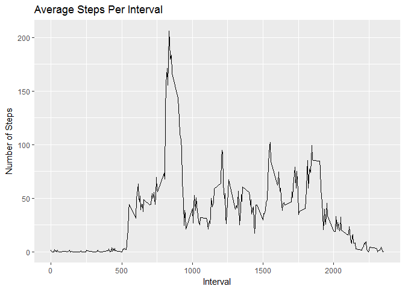
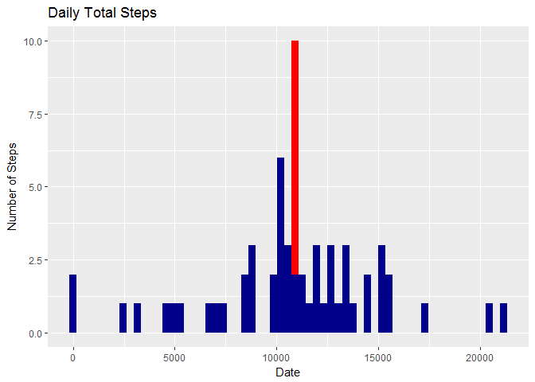
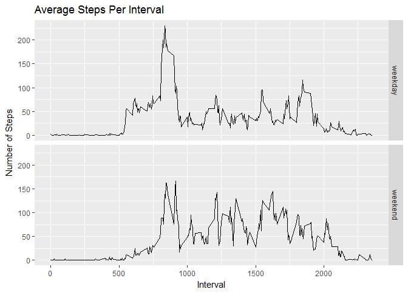

## Introduction

It is now possible to collect a large amount of data about personal movement using activity monitoring devices such as a Fitbit, Nike Fuelband, or Jawbone Up. These type of devices are part of the "quantified self" movement - a group of enthusiasts who take measurements about themselves regularly to improve their health, to find patterns in their behavior, or because they are tech geeks. But these data remain under-utilized both because the raw data are hard to obtain and there is a lack of statistical methods and software for processing and interpreting the data.

This assignment makes use of data from a personal activity monitoring device. This device collects data at 5 minute intervals through out the day. The data consists of two months of data from an anonymous individual collected during the months of October and November, 2012 and include the number of steps taken in 5 minute intervals each day.  
  
### Step 1: Loading and preprocessing the data  
  

  
1.1 Load the data (i.e. read.csv()) and R packages

```r
library(knitr)
library(plyr)
library(ggplot2)

activity <- as.data.frame(read.csv("./activity.csv"))
```
  
1.2 Process/transform the data (if necessary) into a format suitable for analysis

```r
activity$date <- as.Date(activity$date, format="%Y-%m-%d")
activity <- arrange(activity, date)
```
  
  
  
### Step 2: What is mean total number of steps taken per day?
  
For this part of the assignment, the missing values in the dataset are ignored.
2.1 Calculate the total number of steps taken per day

```r
totalSteps_Day <- ddply(activity, .(date), summarize, total=sum(steps))
```

2.2 Make a histogram of the total number of steps taken each day

```r
qplot(total, data=totalSteps_Day, bins=nrow(totalSteps_Day), fill=I("dark blue"), main="Daily Total Steps", xlab="Date", ylab="Number of Steps")
```

```
## Warning: Removed 8 rows containing non-finite values (stat_bin).
```

<!-- -->

2.3 Calculate and report the mean and median of the total number of steps taken per day

```r
avgSteps <- round(mean(totalSteps_Day$total, na.rm=TRUE), 2)
medianSteps <- median(totalSteps_Day$total, na.rm=TRUE)
```
The mean and median of the total number of steps taken per day is 1.076619\times 10^{4} and 10765.  
  
  
### Step 3: What is the average daily activity pattern?
  
3.1 Make a time series plot (i.e. type = "l") of the 5-minute interval (x-axis) and the average number of steps taken, averaged across all days (y-axis)

```r
avgSteps_Interval <- ddply(activity, .(interval), summarize, average=mean(steps, na.rm=TRUE))

qplot(interval, average, data=avgSteps_Interval,
      geom="line", main="Average Steps Per Interval", xlab="Interval", ylab="Number of Steps")
```

<!-- -->
    
3.2 Which 5-minute interval, on average across all the days in the dataset, contains the maximum number of steps?

```r
max(avgSteps_Interval$average)
```

```
## [1] 206.1698
```
  
    

### Step 4: Imputing missing values
  
Note that there are a number of days/intervals where there are missing values (coded as NA). The presence of missing days may introduce bias into some calculations or summaries of the data.  

4.1 Calculate and report the total number of missing values in the dataset (i.e. the total number of rows with NAs)

```r
sum(is.na(activity$steps))
```

```
## [1] 2304
```
       
4.2 Devise a strategy for filling in all of the missing values in the dataset. The strategy does not need to be sophisticated. For example, you could use the mean/median for that day, or the mean for that 5-minute interval, etc.

```r
# Here the means for every 5-minute interval are applied to impute the missing values in the dataset.
imputed_Activity <- ddply(activity, .(interval), summarize, avgSteps=ave(steps, FUN=function(x) mean(x, na.rm=TRUE)), steps=steps, date=date)
```
    
4.3 Create a new dataset that is equal to the original dataset but with the missing data filled in.

```r
# All NAs in the steps column are replaced by the average steps of that 5-minute interval that they locate
imputed_Activity$steps[is.na(imputed_Activity$steps)] <- imputed_Activity$avgSteps[is.na(imputed_Activity$steps)]
```
    
4.4 Make a histogram of the total number of steps taken each day and Calculate and report the mean and median total number of steps taken per day. Do these values differ from the estimates from the first part of the assignment? What is the impact of imputing missing data on the estimates of the total daily number of steps?

```r
# Calculate the total number of steps taken each day based on the imputed dataset
imputed_totalSteps_Day <- ddply(imputed_Activity, .(date), summarize, total=sum(steps))

# Draw overlaying histograms to show the difference (red is imputed dataset, dark blue is original)
qplot(total, data=imputed_totalSteps_Day, bins=nrow(imputed_totalSteps_Day), fill=I("red"), main="Daily Total Steps", xlab="Date", ylab="Number of Steps") + geom_histogram(data=totalSteps_Day, bins=nrow(totalSteps_Day), fill=I("dark blue"), position="identity")
```

```
## Warning: Removed 8 rows containing non-finite values (stat_bin).
```

<!-- -->

```r
imputed_avgSteps <- round(mean(imputed_totalSteps_Day$total, na.rm=TRUE), 2)
imputed_medianSteps <- round(median(imputed_totalSteps_Day$total, na.rm=TRUE), 2)
```
For the imputed dataset, the mean and median of the total number of steps taken per day is 1.076619\times 10^{4} and 1.076619\times 10^{4}. Both are higher than the original numbers.  
  
  
  
### Step 5: Are there differences in activity patterns between weekdays and weekends?  
  
For this part the weekdays() function may be of some help here. Use the dataset with the filled-in missing values for this part.  
  
5.1 Create a new factor variable in the dataset with two levels - "weekday" and "weekend" indicating whether a given date is a weekday or weekend day.   

```r
imputed_Activity$day <- ifelse(weekdays(imputed_Activity$date) %in% c("Saturday", "Sunday"), "weekend", "weekday")
```
  
5.2 Make a panel plot containing a time series plot (i.e. type = "l") of the 5-minute interval (x-axis) and the average number of steps taken, averaged across all weekday days or weekend days (y-axis). See the README file in the GitHub repository to see an example of what this plot should look like using simulated data.  

```r
imputed_avgSteps_Interval <- ddply(imputed_Activity, .(interval, day), summarize, average=mean(steps, na.rm=TRUE))

qplot(interval, average, data=imputed_avgSteps_Interval, facets=day~.,
      geom="line", main="Average Steps Per Interval", xlab="Interval", ylab="Number of Steps")
```

<!-- -->
